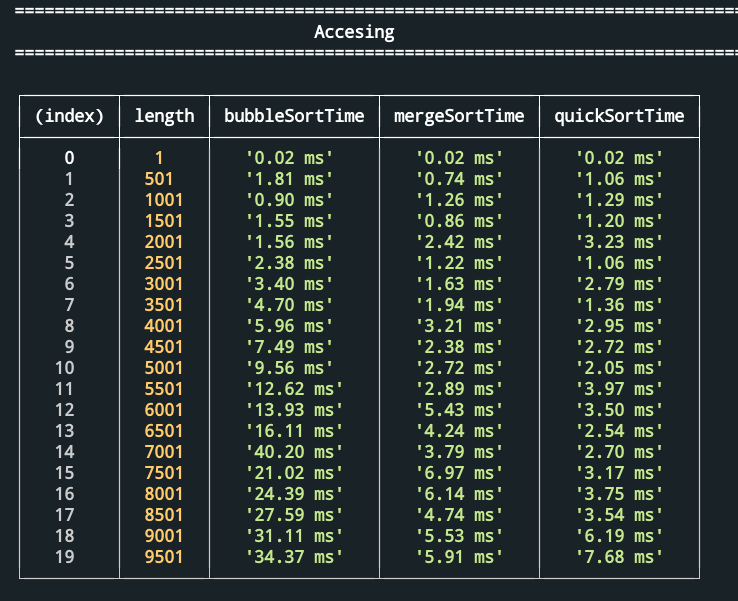
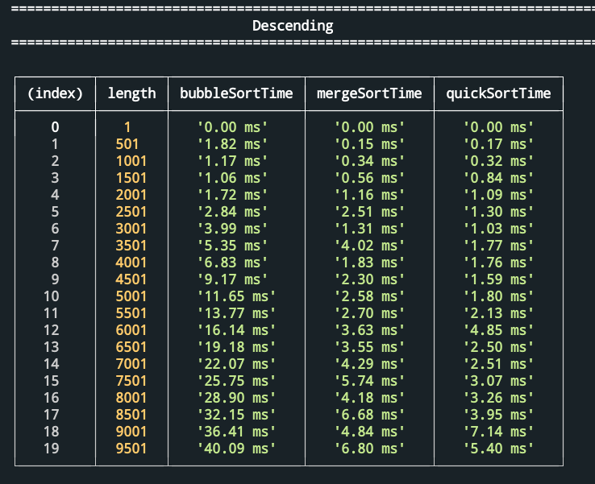
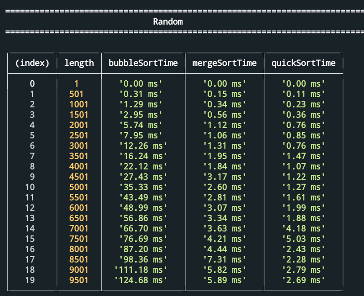

# Analyzing Sorting Algorithm Performance

### Conclusion

In small arr(<500 elments) all sorting algorithm have similar results but as the array grows and becomes more unordered, we get a top like this:

1. quick sort
2. merge sort
3. bubble sort

and complexity represent it

| Place   | Algoritm       | Complexity  |
|---------|----------------|-------------|
|   1     | Quick sort     | O(n log(n)) |
|   2     | Merge sort     | O(n^2)      |
|   3     | Bubble Sort    | O(n^2)      |

  

