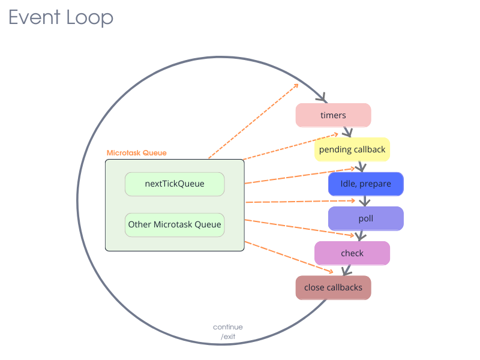

## Libuv

Libuv– is main thing in where are all magic happnes  

### Event multiplexor

Firstly, multiplexor collect all events by the running code and prepare all resources for application call back  

### EventLoop

When all code will have been read Event Loop come to chat and put all in their then execute them queues 

### EvntQueue

 !